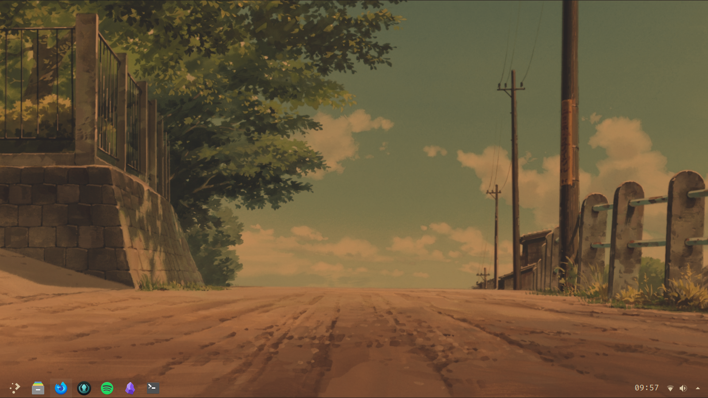
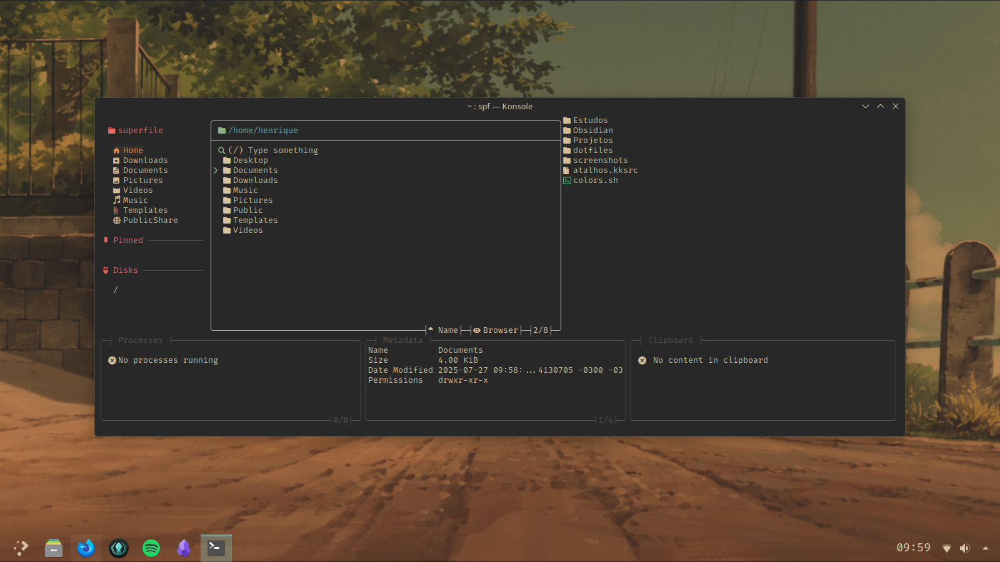
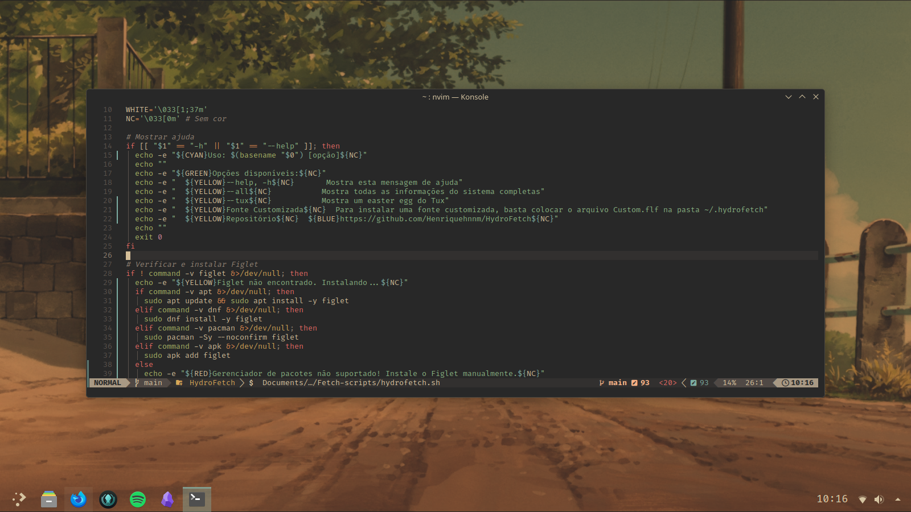
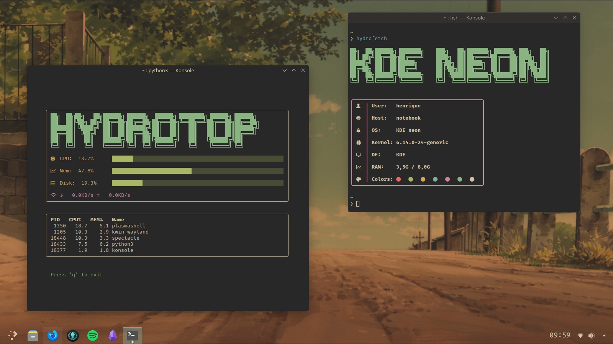

<h1 align="center">Dotfiles — KDE, Fish, Neovim & Style</h1>

<p align="center">
  
</p>

<p align="center">
  💻 Personal Linux setup focused on productivity, beauty and consistency.<br>
  🎨 Fully Gruvbox Material themed with KDE Plasma, Fish Shell and Neovim!
</p>

---

## 📦 Folder Structure

```bash
dotfiles/
├── color-schemes-plasma/
│   └── GruvboxMaterial.colors
│
├── fish/
│   ├── completions/
│   ├── config.fish
│   ├── functions/
│   └── fish_variables
│
├── gitkraken-themes/
│   ├── Gruvbox-material.jsonc
│   └── README.md
│
├── konsole/
│   ├── Gruvbox.colorscheme
│   └── Henrique.profile
│
├── nvim/
│   ├── init.lua
│   ├── lua/
│   ├── LICENSE
│   ├── README.md
│   ├── lazy-lock.json
│   ├── lazyvim.json
│   └── stylua.toml
│
├── superfile/                       
│   ├── theme/
│   ├── config.toml
│   └── hotkeys.toml
│
├── LICENSE
├── README.md
└── colors.sh
```

---

## 📷 Screenshots






	


---

## ✨ Highlights

🎨 **Unified theme**: Everything in Gruvbox Material: Plasma, terminal, shell, Neovim, GitKraken...

🐟 **Fish shell**: With custom functions, variables and autocompletion

📝 **Neovim**: Modern config with LazyVim, plugins, formatter and styling with stylua

🔧 **Superfile**: A TUI File Manager also in Gruvbox Material colors

---

## Badges


---

## 📚 Credits

[Gruvbox Material](https://github.com/sainnhe/gruvbox-material)

[LazyVim](https://www.lazyvim.org/)

[Papirus Icon Theme](https://github.com/PapirusDevelopmentTeam/papirus-icon-theme)

---

## 📝 License

Distributed under the GPLv3 License
