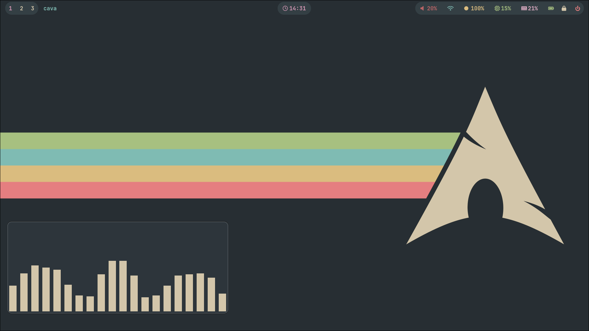

# My Dotfiles

This repository contains my personal configuration files (dotfiles) for a Linux environment. The setup is centered around the Hyprland compositor, aiming for a visually appealing and efficient workflow.

## Screenshots



## Core Components

This setup uses a combination of modern and powerful tools to create a cohesive Wayland experience.

| Category             | Tool                                             |
| -------------------- | ------------------------------------------------ |
| **Operating System** | [Arch Linux](https://archlinux.org/)             |
| **Window Manager**   | [Hyprland](https://hyprland.org/)                |
| **Bar**              | [Waybar](https://github.com/Alexays/Waybar)      |
| **Terminal**         | [Kitty](https://sw.kovidgoyal.net/kitty/)        |
| **Shell**            | [Fish](https://fishshell.com/)                   |
| **Editor**           | [Neovim](https://neovim.io/) (AstroNvim based)   |
| **Launcher**         | [Wofi](https://hg.sr.ht/~scoopta/wofi)           |
| **File Manager**     | [superfile](https://superfile.dev/)              |
| **Notifications**    | [Dunst](https://dunst-project.org/)              |
| **Session Lock**     | [hyprlock](https://hyprland.org/)                |
| **Idle**             | [hypridle](https://hyprland.org/)                |
| **Logout Menu**      | [wlogout](https://github.com/ArtsyMacaw/wlogout) |
| **Wallpapers**       | My wallpaper edited in gimp :)                   |

## Installation

**Disclaimer:** These are my personal dotfiles. Use them at your own risk. Always back up your existing configuration files before proceeding.

The recommended way to manage these dotfiles is to symlink them to the appropriate locations in your home directory (e.g., `~/.config`).

**Example: Linking the `hypr` configuration**

1.  **Back up your existing configuration (if any):**

    ```sh
    mv ~/.config/hypr ~/.config/hypr.bak
    ```

2.  **Create the symbolic link (or copy the files):**
    ```sh
    # Make sure to use the absolute path to this repository
    ln -s /home/broly/Documentos/Projetos/dotfiles/hypr ~/.config/hypr
    ```

Repeat this process for all the desired configurations (`kitty`, `waybar`, `nvim`, `fish`, etc.).

## License

This project is licensed under the terms of the `LICENSE` file.
